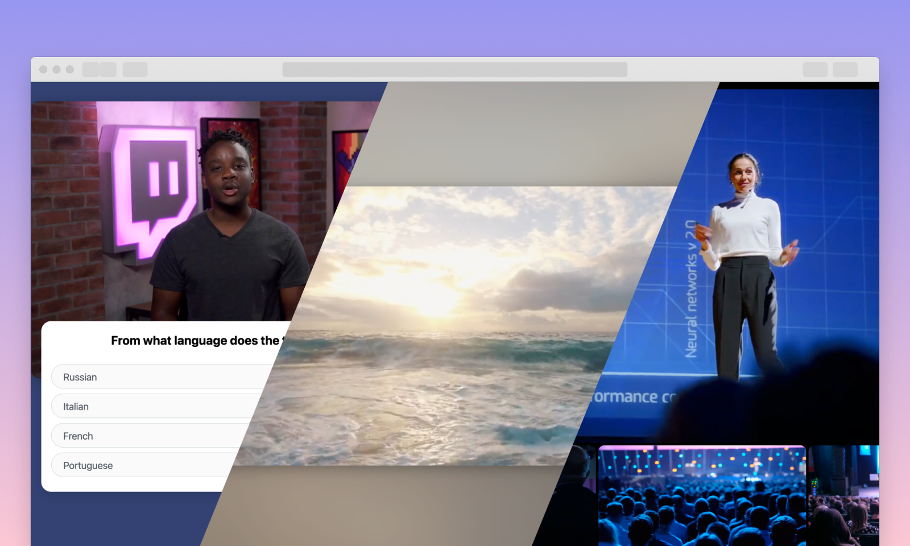

# Amazon IVS Basic Player Demos

This repository contains a collection of plain JavaScript code samples, covering several basic Amazon IVS use cases.
**This project is intended for education purposes only and not for production usage.**




## Demos
**:bulb: Custom Player Controls**

Shows how to leverage Amazon IVS's playerSDK APIs to implement custom player controls (Play/Pause, Mute/Unmute, Quality selection).

**:bulb: Simple Quiz**

Shows how to leverage Amazon IVS's TimedMetadata API to display a basic Quiz interface. Read more about how to [add live video to your apps and websites](https://aws.amazon.com/blogs/aws/amazon-interactive-video-service-add-live-video-to-your-apps-and-websites/).

**:bulb: Multiple Players**

Shows how to instantiate multiple Amazon IVS players simultaneously.

**:bulb: Minimal Player Setup**

Shows a minimal way to implement the Amazon IVS PlayerSDK.

**:bulb: Video.js Integration**

Shows how to use the Amazon IVS PlayerSDK with [Video.js](https://videojs.com/).

**:bulb: Ambiance Canvas**

A demo showing how you can achieve an "ambilight" effect using Canvas and the Amazon IVS Player SDK.

## Getting Started
* Open the `index.html` file of each folder in a modern web browser to test each demo.
* Open any demo's `script.js` in your favorite code editor, and replace the value of `PlaybackUrl` with your own Amazon IVS Playback URL to play your own stream.
* Some demos may require running a local server. Here are a few ways to start one:

### Using Python
- Mac/Linux (Python 3):
  ```bash
  python3 -m http.server 8000
  ```
- Windows (Python 3):
  ```bash
  python -m http.server 8000
  ```

### Using Node.js
First, install a package like `http-server` globally:
```bash
npm install -g http-server
```
Then run:
```bash
http-server
```

After starting the server, visit `http://localhost:8000` in your web browser to view the demos.
Note: The port number (8000) can be changed to any available port on your system.

**Note**: Service Workers (used in the "basic-custom-stream" demo) require the page to be served over either `localhost` or `HTTPS`. For more information, see the [IVS Low-Latency documentation](https://docs.aws.amazon.com/ivs/latest/LowLatencyUserGuide/web-getting-started.html#web-service-worker).


## Known issues and limitations
* These code samples were written for demonstration purposes and not for production use.
* These code samples were only tested on recent Chrome and Firefox versions.

## About Amazon IVS
Amazon Interactive Video Service (Amazon IVS) is a managed live streaming solution that is quick and easy to set up, and ideal for creating interactive video experiences. [Learn more](https://aws.amazon.com/ivs/).

* [Amazon IVS docs](https://docs.aws.amazon.com/ivs/)
* [User Guide](https://docs.aws.amazon.com/ivs/latest/userguide/)
* [API Reference](https://docs.aws.amazon.com/ivs/latest/APIReference/)
* [Setting Up for Streaming with Amazon Interactive Video Service](https://aws.amazon.com/blogs/media/setting-up-for-streaming-with-amazon-ivs/)
* [Learn more about Amazon IVS on IVS.rocks](https://ivs.rocks/)
* [View more demos like this](https://ivs.rocks/examples)

## Security

See [CONTRIBUTING](CONTRIBUTING.md#security-issue-notifications) for more information.

## License

This library is licensed under the MIT-0 License. See the LICENSE file.